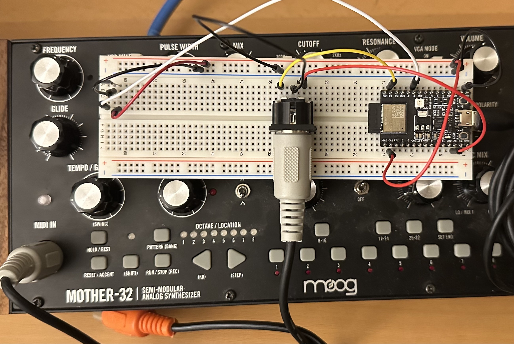

# Proximity Sensor MIDI Controller

## Summary

This project is a Proximity Sensor MIDI Controller, built on the ESP32 microcontroller using the Arduino framework.

It leverages the FreeRTOS for managing delays efficiently. This device translates proximity data into MIDI notes, creating an interactive musical experience.

## Proximity Sensor

The core of this project is the Hall sensor, known for its ability to detect magnetic fields with high precision. In this implementation, the Hall sensor captures minute changes in proximity.

We have configured it to perform one-shot reads every 100 milliseconds in the code, which can be upgraded to continuous reading at 20 MHz for higher precision and responsiveness.

### Hall Sensor Setup

A Hall sensor is a transducer that varies its output voltage in response to a magnetic field. In this project, the sensor is set up to read values from an analog pin and translate these values into a range of distances.

The `analogReadResolution(RESOLUTION)` function sets the resolution of the ADC to a specified value, enhancing the precision of proximity detection.

## MIDI Communication

This device is engineered to interface with an analog MIDI IN DIN connector, making it compatible with various musical instruments like the Moog synthesizer.

It uses an ESP32's serial communication capability to establish a current loop connection with the synthesizer.

The MIDI messages are sent using a standard baud rate of 31,250 bits per second, as defined in the `Serial.begin(31250)` function in the setup.

## Future Plans

The project has several exciting avenues for future development, including:

- Refining the sensor reading algorithm for enhanced musical expressiveness. Even replacing the sensor for a longer range ultrasonic or IR distance sensor.
- Implementing wireless MIDI communication for increased flexibility.
- Exploring the use of machine learning algorithms to predict and generate musical patterns based on sensor inputs.
